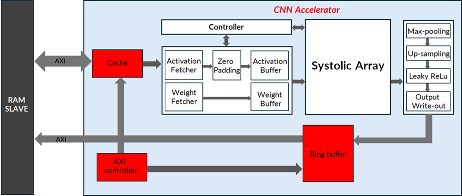

# Yolo_v3_Tiny_AXI
Author: 

  **Nguyen Van Luu** - nluu1784@gmail.com
  
  Name of Institute: **School of Electrical and Electronic Engineering (SEEE)-HUST**    

  Language: **Verilog, Python**

  Framework: **Keras, Pytorch**
  
  Tools: **Cadence Xcelium, Vivado**

